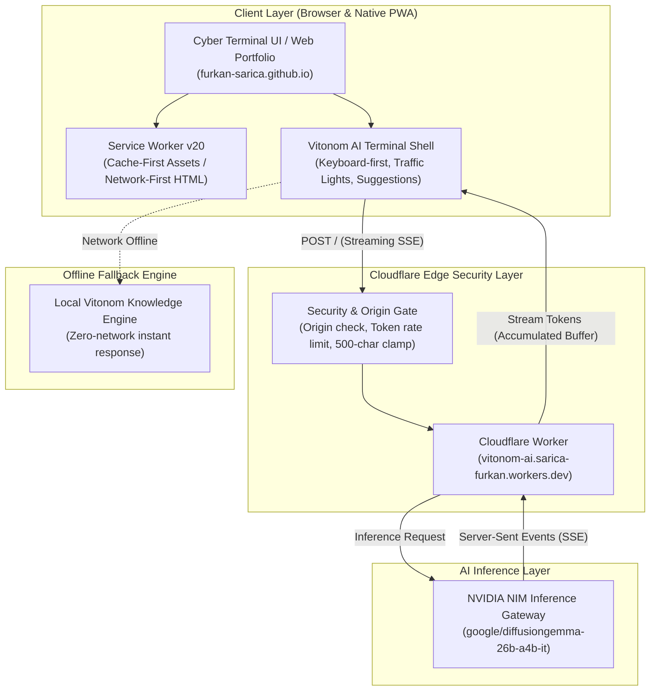

<div align="center">

# Furkan SARICA — Enterprise AI & DevOps Portfolio

[](https://github.com/furkan-sarica/furkan-sarica.github.io/actions/workflows/ci-cd.yml)
[](https://furkan-sarica.github.io)
[](https://furkan-sarica.github.io)
[](https://vitonom-ai.sarica-furkan.workers.dev)
[](https://integrate.api.nvidia.com)
[](https://github.com/furkan-sarica/furkan-sarica.github.io)

**Vanilla HTML/CSS/JS portfolio ve interaktif AI terminali (`Vitonom v2.5`); Playwright yalnız geliştirme/test bağımlılığıdır.**
*Built for real enterprise impact, deterministic systems, and physicalist engineering principles.*

[🌐 Live Deployment](https://furkan-sarica.github.io) • [💬 Launch AI Terminal](https://furkan-sarica.github.io/?chat=open) • [📄 Download CV](https://furkan-sarica.github.io/Furkan%20SARICA%20CV%20TR.pdf)

</div>

---

## 🏛️ System Architecture



---

## ⚡ Key Highlights

### 1. Vitonom AI Terminal Shell (v2.5)
- **High-Intelligence Multilingual LLM:** Backed by Google's 26B instruction model (`google/diffusiongemma-26b-a4b-it`) hosted on NVIDIA NIM.
- **Server-Sent Events (SSE) Streaming:** Low-latency token streaming with an accumulating chunk buffer (`sseBuffer`) to eliminate multi-byte UTF-8 token drops.
- **Zero-Credential Security Architecture:** Frontend never holds API tokens. Requests are proxied via a hardened Cloudflare Edge Worker with strict Origin validation (`furkan-sarica.github.io` only).
- **macOS Window Management:** Interactive window controls — **Red** (close), **Yellow** (minimize to floating dock widget without losing conversation state), and **Green** (maximized 96vw fullscreen IDE mode).

### 2. Progressive Web Application (PWA)
- **Manifest:** `manifest.json` dört uygulama kısayolu içerir. CI, JSON syntax ve referans verilen varlıkları doğrular; tam W3C uyumluluk sertifikasyonu yapmaz.
- **Terminal Native Installer:** Run `./install-pwa.sh` or `install` directly in the shell to trigger the browser's native installation prompt.
- **Önbellek:** `sw.js` cache sürümü `furkan-portfolio-v20`'dir. Statik varlıklarda cache-first, HTML'de network-first kullanır; ağ erişilemezse mevcut cache'e döner. Smoke test offline/PWA uyumluluk testi değildir.

### 3. Production DevOps & DevSecOps
- **CI/CD:** Mevcut required check `Code Quality & DevSecOps Verification`; bütünlük, Gitleaks, XML, JavaScript syntax ve masaüstü/mobil Chromium smoke testlerini kapsar. Başarılı main gate'inden sonra özel workflow GitHub Pages'e deploy eder, ardından canlı smoke çalışır. Canlı smoke başarısızsa workflow fail olur; otomatik rollback yoktur.
- **Syntax gate:** `scripts/verify-javascript.py`, HTMLParser ile inline scriptleri ayıklar; klasik scriptleri Node `vm.Script`, module scriptleri Node syntax check ile doğrular. JSON veri scriptleri çalıştırılabilir JavaScript sayılmaz.
- **Browser smoke:** 1440×900 ve 390×844 viewport'larında HTTP, boot kapanışı, hero, pageerror/console error, TR/EN, ses, ai.sh aç/kapat ve back-to-top doğrulanır. Dış GitHub API/font çağrıları fixture ile karşılanır; AI inference isteği gönderilmez. Testte service worker engellenir; site kodundaki PWA davranışı değişmez.
- **Bütünlük ve sır kontrolü:** `scripts/verify-integrity.py` JSON parse, manifest varlıkları ve service worker cache hedeflerini kontrol eder. Gitleaks bilinen secret kalıplarını tarar; hiçbir tarama sıfır risk garantisi vermez.
- **Yayın ayarı:** İnceleme tarihinde Pages kaynak ayarı `legacy/main` olduğundan bağımsız Pages yayını da tetiklenir. Özel workflow gate'i bu ikinci hattı yönetmez. GitHub ayarları bu PR'da değiştirilmemiştir.

---

## 🛠️ Local Development & DX

This project includes a developer-ergonomic `Makefile` for zero-friction local workflows:

```bash
# Clone the repository
git clone https://github.com/furkan-sarica/furkan-sarica.github.io.git
cd furkan-sarica.github.io

# View available commands
make help

# Run local development server (http://localhost:8080)
make serve

# Test bağımlılıklarını ve Chromium'u kur
npm ci --ignore-scripts
npx --no-install playwright install chromium

# Bütünlük, syntax ve masaüstü/mobil smoke testlerini çalıştır
make test

# Aynı browser smoke'u canlı site üzerinde çalıştır
SMOKE_ADRESI=https://furkan-sarica.github.io/ npm run test:smoke
```

---

## 📂 Repository Layout

```text
├── .github/
│   ├── workflows/ci-cd.yml      # GitHub Actions CI/CD & Deploy Pipeline
│   ├── dependabot.yml           # Automated GitHub Actions updates
│   └── PULL_REQUEST_TEMPLATE.md # Engineering PR template
├── scripts/
│   ├── verify-integrity.py      # PWA bütünlük ve secret kontrolü
│   └── verify-javascript.py     # HTML/JavaScript syntax gate
├── tests/smoke.spec.cjs         # Masaüstü ve mobil browser smoke
├── playwright.config.cjs       # Yerel/canlı test yapılandırması
├── LICENSE                     # MIT
├── SECURITY.md                 # Güvenlik bildirimi politikası
├── index.html                   # Core semantic markup & Cyber Terminal
├── style.css                    # Responsive dark cyber aesthetic & CRT engine
├── sw.js                        # PWA Service Worker (v20)
├── manifest.json                # PWA Manifest with app shortcuts
├── api.json                     # Grounded structured data & bio
├── Makefile                     # Developer task runner
└── package.json                 # Repository metadata & scripts
```

---

## 👨‍💻 Engineer Profile

**Furkan SARICA**  
*AI Solutions Engineer @ CloudSpark Cloud Data & AI Technologies*  
- **Focus:** Enterprise AI Agents, RAG Pipelines, Backend Architectures (Python / FastAPI), DevOps & Infrastructure.
- **Background:** Microsoft AI Innovators (Tracefold Project), Logosoft (SAP Business One AI Platform), Istanbul Gelisim University (MIS Honor Degree).
- **Certifications:** Stanford AI, Microsoft AI & ML, Vanderbilt GenAI, NVIDIA Developer, AWS Solutions Architect, IBM DevOps.

📫 **Contact:** [LinkedIn](https://linkedin.com/in/furkan-sarica) • [Interactive Terminal Shell](https://furkan-sarica.github.io/?chat=open) • [GitHub](https://github.com/furkan-sarica)
